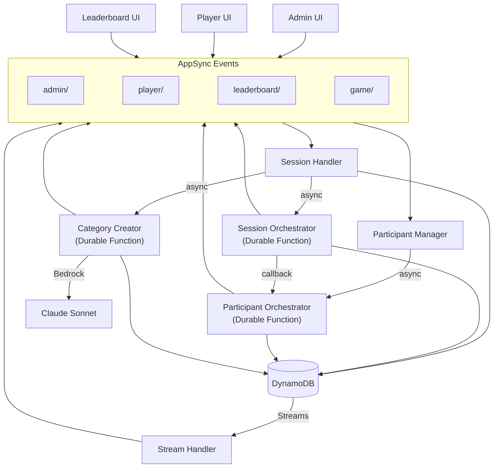

# Trivia Night

A real-time multiplayer trivia game built with AWS AppSync Events, Lambda Durable Functions, and Vue.js. A host creates a session, players join via QR code, answer questions at their own pace, and compete on a live leaderboard.

All communication flows through AppSync Events (WebSocket) — no API Gateway.

## Architecture



### Lambda Functions

| Function | Type | Purpose |
|----------|------|---------|
| **Session Handler** | Standard | Admin commands (create, start, cancel, categories, create_category), state reconstruction on subscribe |
| **Participant Manager** | Standard | Player join, routes answer/skip/ready callbacks to PODs |
| **Session Orchestrator (ODF)** | Durable | Game lifecycle: create session, build question package, start, timer/cancel, end |
| **Participant Orchestrator (POD)** | Durable | Per-player: question delivery, scoring, activity logging, timeout handling |
| **Category Creator** | Durable | AI-powered category generation: calls Bedrock Claude, validates questions, writes to DynamoDB |
| **Stream Handler** | Standard | DDB Streams → leaderboard updates (player joins, score changes, completions) |

### AppSync Events Channels

| Channel | Purpose |
|---------|---------|
| `admin/{sessionId}` | Host commands and state restore |
| `leaderboard/{sessionId}` | Score/status updates from stream handler |
| `player/{sessionId}/{participantId}` | Individual gameplay |
| `game/{sessionId}` | Broadcast events (started, times up, cancel) |

## Prerequisites

- [AWS CLI](https://aws.amazon.com/cli/) configured with a profile
- [AWS SAM CLI](https://docs.aws.amazon.com/serverless-application-model/latest/developerguide/install-sam-cli.html) v1.153+
- Node.js 22+
- An AWS account with Bedrock model access enabled (Claude Sonnet)

## Setup

### 1. Deploy the backend

```bash
sam build
sam deploy --guided
```

SAM will prompt for the `AdminEmail` parameter — this creates the first admin user in Cognito. They'll receive a temporary password by email.

Note the outputs — you'll need the AppSync endpoints, API key, and Cognito IDs.

### 2. Set up the frontend

```bash
cd frontend
npm install
cp .env.example .env
```

Edit `.env` with the values from `sam deploy` outputs:

```
VITE_APPSYNC_HTTP_ENDPOINT=https://YOUR_API_ID.appsync-api.us-west-2.amazonaws.com/event
VITE_APPSYNC_REALTIME_ENDPOINT=wss://YOUR_API_ID.appsync-realtime-api.us-west-2.amazonaws.com/event/realtime
VITE_APPSYNC_API_KEY=your-api-key-here
VITE_COGNITO_USER_POOL_ID=us-west-2_XXXXXXXXX
VITE_COGNITO_CLIENT_ID=your-client-id-here
VITE_AWS_REGION=us-west-2
```

### 3. Create question categories

Categories are generated by AI directly from the admin UI. No seed scripts needed.

1. Open the game controller (`/controller`) and sign in with your admin email and temporary password
2. Set a new permanent password when prompted
3. In the setup screen, use the "Create New Category" section
4. Enter a topic (e.g. "Space Exploration", "90s Hip Hop", "World War II")
5. Click Generate — Bedrock Claude will create 60 trivia questions (20 easy, 20 medium, 20 hard)
6. Wait about a minute for generation to complete
7. The new category appears in the dropdown, ready to use

You can create as many categories as you want. Each generation produces a fresh set of questions.

### 4. Run locally

```bash
cd frontend
npm run dev
```

Open `http://localhost:5173/controller` to create a game.

## Game Flow

1. **Host** signs in at `/controller`, selects category and mode, creates session
2. **Players** scan QR code → `/play/{sessionId}`, enter display name, join
3. **Host** clicks Start → synchronized 5-second countdown on all screens
4. **Players** answer questions at their own pace (30s per question, skip/more time options)
5. **Leaderboard** (`/leaderboard/{sessionId}`) shows real-time scores with top 10 + expandable full list
6. **Game ends** when timer expires (timed mode) or host cancels
7. **Players** see a post-game report with correct/wrong/skipped breakdown and answer review

### Game Modes

| Mode | Description |
|------|-------------|
| **Timed** | 1–5 minutes. All players answer as many questions as they can before time runs out. |
| **Question Count** | 1–30 questions. Game ends when all players finish or 5-minute hard cap. |

### Scoring

| Difficulty | Points (correct) | Points (incorrect/skip) |
|-----------|------------------|------------------------|
| Easy | 10 | 0 |
| Medium | 20 | 0 |
| Hard | 30 | 0 |

## Project Structure

```
trivia/
├── template.yaml                 # SAM template — all AWS resources
├── samconfig.toml                # SAM deploy configuration
├── amplify.yml                   # Amplify build spec
├── functions/
│   ├── session-handler/          # Admin commands + state reconstruction
│   ├── participant-manager/      # Player join + callback routing
│   ├── session-orchestrator/     # Game lifecycle (durable function)
│   ├── participant-orchestrator/ # Per-player gameplay (durable function)
│   ├── category-creator/         # AI category generation (durable function)
│   └── stream-handler/           # DDB Streams → leaderboard updates
├── frontend/
│   ├── src/
│   │   ├── views/
│   │   │   ├── HomeView.vue        # Landing page
│   │   │   ├── AdminView.vue       # Host controller (auth-gated)
│   │   │   ├── PlayerView.vue      # Player game UI
│   │   │   ├── LeaderboardView.vue # Live scoreboard (500-player scale)
│   │   │   └── NotFoundView.vue
│   │   ├── appsync-events.ts   # WebSocket client (dual auth)
│   │   ├── auth.ts             # Cognito auth (zero-dependency)
│   │   ├── router.ts
│   │   └── main.ts
│   └── .env.example
```

Each Lambda function is fully self-contained with its own dependencies. Shared utilities are copied into each function's `shared/` directory and bundled by esbuild.

## Key Design Decisions

- **All-WebSocket**: No API Gateway. All client-server communication through AppSync Events.
- **Durable Functions**: Game and player orchestration use Lambda Durable Functions for reliable state management across long-running game sessions.
- **AI-generated categories**: Bedrock Claude generates trivia questions on demand — no manual question authoring needed.
- **Cognito auth for hosts**: Admin actions require authentication. Players join unauthenticated via QR code.
- **DDB Streams for leaderboard**: PODs write to DynamoDB, Stream Handler computes and broadcasts leaderboard updates.
- **Tiered leaderboard**: Top 10 with animated transitions, expandable list for 500+ players.
- **Post-game report**: Players see which questions they got right/wrong with correct answers.
- **Self-contained functions**: Each Lambda bundles all its dependencies (including AWS SDK) — no layers, no shared external imports.

## Tech Stack

- **Frontend**: Vue.js 3, TypeScript, Vite, Vue Router
- **Backend**: AWS Lambda (Node.js 22, ARM64), TypeScript, esbuild
- **Orchestration**: AWS Lambda Durable Functions
- **Real-time**: AWS AppSync Events (WebSocket pub/sub)
- **AI**: Amazon Bedrock (Claude Sonnet)
- **Auth**: Amazon Cognito
- **Database**: Amazon DynamoDB (two tables, streams enabled)
- **Hosting**: AWS Amplify
- **IaC**: AWS SAM
