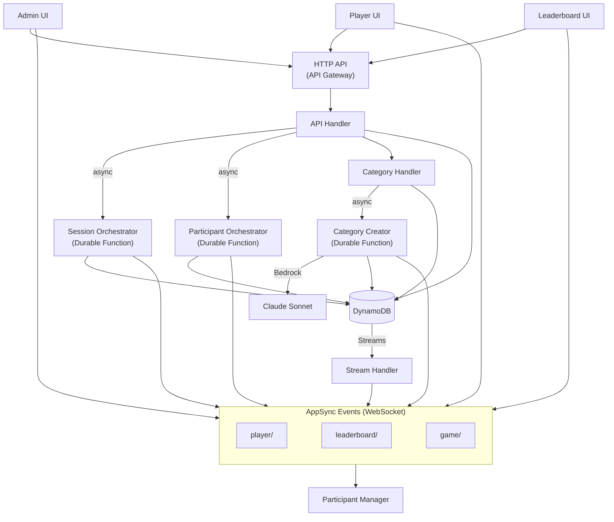

# Trivia Night

A real-time multiplayer trivia game built with AWS AppSync Events, Lambda Durable Functions, and Vue.js. A host creates a session, players join via QR code, answer questions at their own pace, and compete on a live leaderboard.

Commands (create, start, cancel, join) use a REST API (API Gateway HTTP API). Real-time updates (game events, questions, leaderboard) flow through AppSync Events (WebSocket).

## Architecture


```mermaid
graph TD
    Admin["Admin UI"] --> API["HTTP API<br/>(API Gateway)"]
    Admin --> AppSync
    Player["Player UI"] --> API
    Player --> AppSync
    Leaderboard["Leaderboard UI"] --> API
    Leaderboard --> AppSync

    subgraph AppSync["AppSync Events (WebSocket)"]
        direction LR
        ch2["player/"] ~~~ ch3["leaderboard/"] ~~~ ch4["game/"]
    end

    API --> AH["API Handler"]
    AppSync --> PM["Participant Manager"]

    AH -->|async| ODF["Session Orchestrator<br/>(Durable Function)"]
    AH -->|async| POD["Participant Orchestrator<br/>(Durable Function)"]
    AH --> CH["Category Handler"]
    CH -->|async| CC["Category Creator<br/>(Durable Function)"]
    CC -->|Bedrock| AI["Claude Sonnet"]

    AH --> DDB[("DynamoDB")]
    ODF --> DDB
    POD --> DDB
    CH --> DDB
    CC --> DDB

    DDB -->|Streams| STR["Stream Handler"]
    STR --> AppSync
    ODF --> AppSync
    POD --> AppSync
    CC --> AppSync
```

### Lambda Functions

| Function | Type | Purpose |
|----------|------|---------|
| **Session Handler** | Standard | Admin commands (create, start, cancel), state reconstruction on subscribe |
| **Participant Manager** | Standard | Player join, routes answer/skip/ready callbacks to PODs |
| **Category Handler** | Standard | Category CRUD (list, create, rename, delete) |
| **Session Orchestrator (ODF)** | Durable | Game lifecycle: create session, build question package, start, timer/cancel, end |
| **Participant Orchestrator (POD)** | Durable | Per-player: question delivery, scoring, activity logging, timeout handling |
| **Category Creator** | Durable | AI-powered category generation: research, generate, validate, save to DynamoDB |
| **Stream Handler** | Standard | DDB Streams → leaderboard updates (player joins, score changes, completions) |

### AppSync Events Channels

| Channel | Auth | Purpose |
|---------|------|---------|
| `admin/{sessionId}` | Cognito + API_KEY | Host commands and state restore |
| `categories/default` | Cognito + API_KEY | Category management (list, create, rename, delete) |
| `leaderboard/{sessionId}` | API_KEY | Score/status updates from stream handler |
| `player/{sessionId}/{participantId}` | API_KEY | Individual gameplay |
| `game/{sessionId}` | API_KEY | Broadcast events (started, times up, cancel) |

## Prerequisites

- [AWS CLI](https://aws.amazon.com/cli/) configured with a profile
- [AWS SAM CLI](https://docs.aws.amazon.com/serverless-application-model/latest/developerguide/install-sam-cli.html) v1.153+
- Node.js 22+
- An AWS account with Bedrock model access enabled (Claude Sonnet)

## Setup

### 1. Deploy the backend

```bash
sam build
sam deploy --guided
```

SAM will prompt for the `AdminEmail` parameter — this creates the first admin user in Cognito. They'll receive a temporary password by email.

Note the outputs — you'll need the AppSync endpoints, API key, and Cognito IDs.

### 2. Set up the frontend

```bash
cd frontend
npm install
cp .env.example .env
```

Edit `.env` with the values from `sam deploy` outputs:

```
VITE_APPSYNC_HTTP_ENDPOINT=https://YOUR_API_ID.appsync-api.us-west-2.amazonaws.com/event
VITE_APPSYNC_REALTIME_ENDPOINT=wss://YOUR_API_ID.appsync-realtime-api.us-west-2.amazonaws.com/event/realtime
VITE_APPSYNC_API_KEY=your-api-key-here
VITE_COGNITO_USER_POOL_ID=us-west-2_XXXXXXXXX
VITE_COGNITO_CLIENT_ID=your-client-id-here
VITE_AWS_REGION=us-west-2
```

### 3. Create question categories

Categories are generated by AI from the category management page.

1. Open `/controller` and sign in with your admin email and temporary password
2. Set a new permanent password when prompted
3. Navigate to **Categories** in the top nav
4. Enter a topic (e.g. "Space Exploration", "90s Hip Hop", "World War II")
5. Click **Generate** — the AI will research the topic, generate 60 questions, validate them, and save
6. Watch the live progress updates as it works through each step
7. The new category appears in the list and is ready to use in games

You can also rename or delete categories from this page.

### 4. Run locally

```bash
cd frontend
npm run dev
```

Open `http://localhost:5173` to see the landing page, or `/controller` to manage games.

### 5. Deploy the frontend (Amplify)

The repo includes an `amplify.yml` build spec. Connect the repo to AWS Amplify and set these environment variables in the Amplify console:

- `VITE_APPSYNC_HTTP_ENDPOINT`
- `VITE_APPSYNC_REALTIME_ENDPOINT`
- `VITE_APPSYNC_API_KEY`
- `VITE_COGNITO_USER_POOL_ID`
- `VITE_COGNITO_CLIENT_ID`
- `VITE_AWS_REGION`

## Game Flow

1. **Host** signs in at `/controller`, selects category and mode, creates session
2. **Players** scan QR code → `/play/{sessionId}`, enter display name, join
3. **Host** clicks Start → synchronized 5-second countdown on all screens
4. **Players** answer questions at their own pace (30s per question, skip/more time options)
5. **Leaderboard** (`/leaderboard/{sessionId}`) shows real-time scores with top 10 + expandable full list
6. **Game ends** when timer expires (timed mode) or host cancels
7. **Players** see a post-game report with correct/wrong/skipped breakdown and answer review

### Game Modes

| Mode | Description |
|------|-------------|
| **Timed** | 1–5 minutes. All players answer as many questions as they can before time runs out. |
| **Question Count** | 1–30 questions. Game ends when all players finish or 5-minute hard cap. |

### Scoring

| Difficulty | Points (correct) | Points (incorrect/skip) |
|-----------|------------------|------------------------|
| Easy | 10 | 0 |
| Medium | 20 | 0 |
| Hard | 30 | 0 |

## Project Structure

```
trivia/
├── template.yaml                 # SAM template — all AWS resources
├── samconfig.toml                # SAM deploy configuration
├── amplify.yml                   # Amplify build spec
├── functions/
│   ├── session-handler/          # Admin commands + state reconstruction
│   ├── participant-manager/      # Player join + callback routing
│   ├── category-handler/         # Category CRUD (list, create, rename, delete)
│   ├── category-creator/         # AI category generation (durable function)
│   ├── session-orchestrator/     # Game lifecycle (durable function)
│   ├── participant-orchestrator/ # Per-player gameplay (durable function)
│   └── stream-handler/           # DDB Streams → leaderboard updates
├── frontend/
│   ├── src/
│   │   ├── views/
│   │   │   ├── HomeView.vue        # Landing page
│   │   │   ├── AdminView.vue       # Host controller (auth-gated)
│   │   │   ├── CategoriesView.vue  # Category management (auth-gated)
│   │   │   ├── PlayerView.vue      # Player game UI
│   │   │   ├── LeaderboardView.vue # Live scoreboard (500-player scale)
│   │   │   └── NotFoundView.vue
│   │   ├── appsync-events.ts   # WebSocket client (dual auth: API_KEY + Cognito)
│   │   ├── auth.ts             # Cognito auth (zero-dependency, REST API)
│   │   ├── router.ts
│   │   └── main.ts
│   └── .env.example
```

Each Lambda function is fully self-contained with its own dependencies. Shared utilities are copied into each function's `shared/` directory and bundled by esbuild.

## Key Design Decisions

- **Hybrid API**: REST (API Gateway HTTP API) for commands and state queries. WebSocket (AppSync Events) for real-time push updates.
- **Client-driven game start**: POD includes its callback token in join_ack. Client wakes its own POD when countdown hits zero — no ODF fan-out.
- **Direct leaderboard publish**: PODs publish score updates directly to the leaderboard channel. No stream handler dependency for gameplay updates.
- **Durable Functions**: Game and player orchestration use Lambda Durable Functions for reliable state management across long-running game sessions.
- **AI-generated categories**: Bedrock Claude generates trivia questions on demand via a multi-step pipeline (research → generate → validate → save) with live progress updates.
- **Cognito auth for hosts**: Admin endpoints require JWT auth. Players join unauthenticated.
- **Self-contained functions**: Each Lambda bundles all its dependencies (including AWS SDK) — no layers, no shared external imports.

## Tech Stack

- **Frontend**: Vue.js 3, TypeScript, Vite, Vue Router
- **Backend**: AWS Lambda (Node.js 22, ARM64), TypeScript, esbuild
- **Orchestration**: AWS Lambda Durable Functions
- **Real-time**: AWS AppSync Events (WebSocket pub/sub)
- **AI**: Amazon Bedrock (Claude Sonnet)
- **Auth**: Amazon Cognito
- **Database**: Amazon DynamoDB (two tables, streams enabled)
- **Hosting**: AWS Amplify
- **IaC**: AWS SAM
